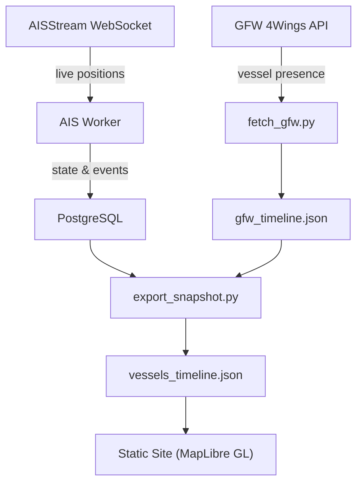

# Strait of Hormuz — Maritime Passage Tracker

A real-time vessel tracking dashboard for the Strait of Hormuz, combining [Global Fishing Watch](https://globalfishingwatch.org/) satellite data with live AIS streams.

Tracks vessel movements, classifies strait crossings (inbound/outbound), and visualizes daily traffic patterns through an interactive MapLibre GL map with historical playback.

## Features

- **Live AIS tracking** via [AISStream](https://aisstream.io/) WebSocket — persistent vessel monitoring with crossing detection
- **GFW satellite data** — 30-day historical vessel presence (AIS grid + SAR detections)
- **MMSI-based deduplication** — merges GFW and live AIS, tagging vessels as `gfw`, `ais`, or `both`
- **Interactive map** — MapLibre GL with directional arrow markers, vessel trails, TSS shipping lanes, and geofence zones
- **Timeline playback** — slider through 30 days of daily vessel positions
- **Crossings chart** — stacked bar chart (Observable Plot) with LOESS trend line, switchable between direction and vessel type views
- **Data source toggle** — filter view by ALL / GFW / AIS
- **Light/dark theme** — CartoDB Positron/Dark Matter basemaps

## Architecture



## Quick Start

### Prerequisites

- Python 3.12+
- [Poetry](https://python-poetry.org/)
- [pnpm](https://pnpm.io/)
- Docker & Docker Compose
- API keys: [AISStream](https://aisstream.io/) and [Global Fishing Watch](https://globalfishingwatch.org/our-apis/)

### 1. Clone and install

```bash
git clone https://github.com/yourusername/strait-of-hormuz.git
cd strait-of-hormuz

# Python dependencies
poetry install

# Frontend dependencies
cd site && pnpm install && cd ..
```

### 2. Configure environment

```bash
cp .env.example .env
# Edit .env with your API keys:
#   AISSTREAM_API_KEY=...
#   GFW_API_ACCESS_TOKEN=...
```

### 3. Start the stack

```bash
# Start PostgreSQL + all workers (AIS tracker + GFW fetcher)
docker compose up -d

# Check workers are running
docker compose logs worker --tail 20
```

### 4. Build and serve the frontend

```bash
cd site
pnpm run build          # one-time build
pnpm run watch          # or dev watch mode

# Serve the site
python3 -m http.server 8090
```

Open [http://localhost:8090](http://localhost:8090).

## Running Without Docker

If you prefer running the workers directly:

```bash
# Start PostgreSQL separately, then:
export HORMUZ_DB_HOST=localhost HORMUZ_DB_PORT=5432
export HORMUZ_DB_NAME=hormuz HORMUZ_DB_USER=hormuz HORMUZ_DB_PASSWORD=hormuz

# Fetch GFW data (one-off)
poetry run fetch-gfw

# Start live AIS tracker
poetry run tracker

# Merge GFW + AIS into site data
poetry run export-snapshot
```

## Project Structure

```
strait-of-hormuz/
├── worker/
│   ├── maritime_passages_live.py   # Live AIS WebSocket tracker
│   ├── gfw_periodic_fetch.py       # Periodic GFW fetcher (every 5 days)
│   ├── persistent_workers.py       # Worker supervisor with auto-restart
│   └── db.py                       # PostgreSQL connection helper
├── scripts/
│   ├── fetch_gfw.py                # GFW API data pipeline
│   ├── export_snapshot.py          # Merge GFW + AIS → vessels_timeline.json
│   └── snapshot_ais.py             # Quick AIS snapshot utility
├── site/
│   ├── src/app.ts                  # Frontend application (TypeScript)
│   ├── index.html                  # Main page
│   ├── style.css                   # Styles (light/dark themes)
│   └── data/                       # Generated data files (gitignored)
├── config.yaml                     # Passage definitions and tracker settings
├── docker-compose.yml              # PostgreSQL + Worker services
├── Dockerfile.worker               # Worker container image
└── pyproject.toml                  # Python dependencies and scripts
```

## Data Pipeline

| Step | Script | Input | Output | Schedule |
|------|--------|-------|--------|----------|
| GFW fetch | `fetch_gfw.py` | GFW 4Wings API | `gfw_timeline.json` | Every 5 days |
| AIS tracking | `maritime_passages_live.py` | AISStream WebSocket | PostgreSQL tables | Continuous |
| Merge & export | `export_snapshot.py` | `gfw_timeline.json` + PostgreSQL | `vessels_timeline.json` | After GFW fetch |

## Environment Variables

| Variable | Required | Description |
|----------|----------|-------------|
| `AISSTREAM_API_KEY` | Yes | AISStream WebSocket API key |
| `GFW_API_ACCESS_TOKEN` | Yes | Global Fishing Watch API token |
| `HORMUZ_DB_HOST` | No | PostgreSQL host (default: `localhost`) |
| `HORMUZ_DB_PORT` | No | PostgreSQL port (default: `5432`) |
| `HORMUZ_DB_NAME` | No | Database name (default: `hormuz`) |
| `HORMUZ_DB_USER` | No | Database user (default: `hormuz`) |
| `HORMUZ_DB_PASSWORD` | No | Database password (default: `hormuz`) |
| `GFW_FETCH_INTERVAL_HOURS` | No | Hours between GFW fetches (default: `120`) |
| `PERSISTENT_TRACKERS` | No | Comma-separated worker names (default: `maritime-passages-live,gfw-periodic-fetch`) |

## Methodology

### How crossings are detected

A **crossing** is recorded when a vessel moves between the west approach zone (Persian Gulf side) and the east approach zone (Gulf of Oman side) of the strait.

| | Live AIS | GFW Historical |
|---|---|---|
| **Method** | Two-zone state machine: vessel enters zone A, then appears in zone B | Day-to-day longitude transition across 56.5°E meridian |
| **Window** | Must complete within 18 hours | Consecutive calendar days |
| **Dedup** | 6-hour minimum gap between events per vessel | 1 crossing per vessel per day max |
| **Resolution** | Real-time (seconds) | Daily (24h UTC aggregate) |

**Inbound** = east to west (entering Persian Gulf). **Outbound** = west to east (leaving toward Gulf of Oman).

### Daily snapshot timing

Each date on the timeline represents a **full 24-hour UTC day** as aggregated by GFW — one record per vessel per day, no duplicates. Positions are **snapped to a spatial grid** (not precise GPS), representing the grid cell where the vessel was detected. Vessels in the same cell appear as overlapping markers. The `hours` field indicates detection duration (2h = passing through, 20h = anchored). GFW data has a **~5-day lag** from the current date. Live AIS is real-time but only merged into dates with existing GFW coverage.

### Limitations

- Vessels can disable AIS transponders ("go dark"), especially in conflict zones
- GFW daily positions are aggregated — exact transit time within a day is unknown
- Small vessels without AIS class A/B transponders are not tracked
- AIS spoofing (false position reports) can occur in this region

## Data Sources

- **[Global Fishing Watch](https://globalfishingwatch.org/)** — Satellite-derived vessel presence (AIS + SAR)
- **[AISStream](https://aisstream.io/)** — Real-time AIS position reports via WebSocket
- **Basemaps** — [CARTO](https://carto.com/) Positron and Dark Matter via MapLibre GL

## Data Releases

Cumulative and rolling 30-day data snapshots are published as [GitHub Releases](../../releases) on each rebuild cycle (~every 5 days). Each release includes:

- `vessels_timeline.json` — Full cumulative GFW + AIS merged timeline
- `vessels_timeline_30d.json` — Rolling 30-day batch
- `gfw_timeline.json` — GFW-only timeline
- `vessels.json` — Flat vessel metadata snapshot

## License

- **Code**: [GPL-3.0](LICENSE)
- **Data**: See [DATA_LICENSE.md](DATA_LICENSE.md) — GFW data is [CC BY-NC 4.0](https://creativecommons.org/licenses/by-nc/4.0/) (non-commercial only, attribution required), AIS data is from public broadcasts
